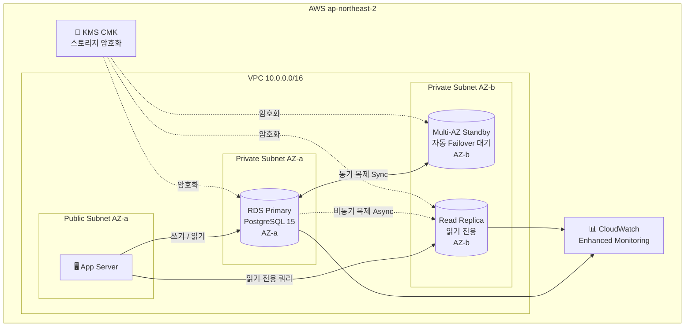

# 🏋️‍♂️ 피트니스 센터 관리 시스템

**박광민**


---

## 📌 프로젝트 개요

피트니스 센터에서 발생하는 다양한 데이터를 효율적으로 관리하기 위한 데이터베이스 시스템입니다.

회원 정보, 트레이너 배정, PT 예약 일정, 운동 기록, 결제 내역을 저장하고 관리합니다.

---

## ✔ 기능 요구사항

1. 관리자는 회원 정보를 등록, 수정, 삭제할 수 있어야 한다.
2. 회원은 특정 트레이너와 PT 세션을 예약할 수 있어야 한다.
3. 한 명의 트레이너는 여러 회원을 담당할 수 있어야 한다.
4. 회원은 운동 결과(날짜, 운동 종류, 세트, 무게 등)를 기록할 수 있어야 한다.
5. PT 예약은 날짜와 시간 단위로 관리되어야 한다.
6. 회원은 여러 건의 PT 결제를 할 수 있으며, 모든 결제 내역이 저장되어야 한다.

---

## ✔ 비기능 요구사항

1. 데이터 무결성을 유지해야 한다.
2. 정규화를 통해 데이터 중복을 최소화해야 한다.
3. 모든 엔티티는 기본 키를 포함해야 한다.
4. 삭제 및 수정 시 참조 무결성이 보장되어야 한다.

---

## 📘 Entities (Summary)

### **1. Member**
- member_id (PK)
- name, phone, gender, join_date, expiry_date, remaining_pt_count

### **2. Trainer**
- trainer_id (PK)
- name, specialty, career_year

### **3. PT_Session**
- session_id (PK)
- member_id (FK → Member.member_id)
- trainer_id (FK → Trainer.trainer_id)
- session_date, session_time, status

### **4. Exercise**
- exercise_id (PK)
- name, part

### **5. Workout_Log**
- log_id (PK)
- member_id (FK → Member.member_id)
- exercise_id (FK → Exercise.exercise_id)
- log_date, weight, sets, reps, feedback

### **6. Payment**
- payment_id (PK)
- member_id (FK → Member.member_id)
- amount, payment_date, method, category

---

## 🔗 Relationship Summary

### **Trainer — PT_Session**
- Relationship: **1 : N**
- One trainer can conduct PT sessions for many members.
- Each PT session is linked to a single trainer.

### **Member — PT_Session**
- Relationship: **1 : N**
- One member can reserve multiple PT sessions.

### **Member — Workout_Log**
- Relationship: **1 : N**
- One member can have many workout logs.

### **Exercise — Workout_Log**
- Relationship: **1 : N**
- One exercise type can appear in multiple workout logs.

### **Member — Payment**
- Relationship: **1 : N**
- A member can have multiple payment records.

---

## 📚 Relational Schema (Summary)

**Member(** member_id PK, name, phone, gender, join_date, expiry_date, remaining_pt_count **)**

**Trainer(** trainer_id PK, name, specialty, career_year **)**

**Exercise(** exercise_id PK, name, part **)**

**PT_Session(** session_id PK, member_id FK, trainer_id FK, session_date, session_time, status **)**

**Workout_Log(** log_id PK, member_id FK, exercise_id FK, log_date, weight, sets, reps, feedback **)**

**Payment(** payment_id PK, member_id FK, amount, payment_date, method, category **)**

---

## 📎 ER 다이어그램


---

## 🐳 로컬 실행 (Docker)

Oracle XE 환경을 Docker로 한 번에 실행할 수 있습니다.

```bash
docker compose up -d
```

- Oracle XE 21c 컨테이너가 시작되며 스키마와 샘플 데이터가 자동으로 초기화됩니다.
- 최초 실행 시 초기화에 약 2~3분 소요됩니다.

**접속 정보**

| 항목 | 값 |
|------|-----|
| Host | localhost |
| Port | 1521 |
| User | gymuser |
| Password | gymuser123 |
| SID | XE |

**컨테이너 종료**
```bash
docker compose down        # 컨테이너만 종료 (데이터 유지)
docker compose down -v     # 컨테이너 + 볼륨 삭제
```

---

## ✅ CI — SQL 린트 (GitHub Actions)

`.sql` 파일이 변경되어 push 또는 PR이 생성되면 **sqlfluff**가 자동으로 SQL 문법을 검사합니다.

```
.sql 파일 변경 push / PR
  └─ lint.yml : sqlfluff lint *.sql --dialect oracle
```

---

## ☁️ AWS RDS + Terraform (Stage 3)

Oracle XE → **PostgreSQL 15** 로 마이그레이션 후 AWS RDS에 배포합니다.

> PostgreSQL을 선택한 이유: RDS 프리티어 지원(`db.t3.micro`), Oracle과 유사한 SQL 문법, 실무 채택률 1위

### 디렉터리 구조

```
terraform/
├── main.tf                   # provider, backend 설정
├── variables.tf              # 모든 입력 변수
├── outputs.tf                # endpoint, port 등 출력
├── vpc.tf                    # VPC, Subnet, SG
├── rds.tf                    # RDS Primary + Read Replica + IAM
├── kms.tf                    # KMS (암호화 활성화 시 생성)
└── terraform.tfvars.example  # 설정 예시

sql/
└── 01_create_tables_pg.sql   # Oracle → PostgreSQL 마이그레이션 스키마
```

### Stage 3 실행 (dev — 프리티어)

```bash
cd terraform
cp terraform.tfvars.example terraform.tfvars
# terraform.tfvars에서 db_password 수정

terraform init
terraform plan
terraform apply
```

**비용 (dev, ap-northeast-2 기준)**

| 리소스 | 스펙 | 월 비용 |
|--------|------|---------|
| RDS PostgreSQL | db.t3.micro, 20GB gp3 | 프리티어 750시간 무료 |
| VPC, Subnet, SG | - | 무료 |

---

## 🏗️ Multi-AZ + Read Replica + 암호화 (Stage 4)

> 비용 문제로 **실습 대신 Terraform 코드 + 아키텍처 다이어그램**으로 대체합니다.
> `terraform.tfvars`에서 플래그만 바꾸면 동일 코드로 prod 구성 적용 가능합니다.

### 아키텍처



### Multi-AZ vs Read Replica 비교

| 항목 | Multi-AZ Standby | Read Replica |
|------|-----------------|--------------|
| 목적 | **고가용성 (HA)** — 장애 복구 | **읽기 확장** — 부하 분산 |
| 복제 방식 | 동기(Synchronous) | 비동기(Asynchronous) |
| 직접 쿼리 | ❌ 불가 | ✅ 가능 |
| Failover | 자동 (60~120초) | 수동 프로모션 |
| AZ | Primary와 다른 AZ | 설정 가능 (심지어 다른 Region) |

### Stage 4 적용 방법

```hcl
# terraform.tfvars
environment         = "prod"
db_instance_class   = "db.t3.small"
multi_az            = true
create_read_replica = true
storage_encrypted   = true
```

```bash
terraform apply   # 변수만 바꾸면 동일 코드로 prod 구성 완성
```

**비용 (prod, ap-northeast-2 기준)**

| 리소스 | 월 비용 (약) |
|--------|------------|
| RDS Primary (db.t3.small, Multi-AZ) | ~$60 |
| Read Replica (db.t3.small) | ~$30 |
| KMS CMK | ~$1 |
| **합계** | **~$91/월** |

---

## 🛠 사용 기술

| 분야 | 기술 |
|------|------|
| 데이터베이스 | Oracle Database XE 21c (로컬), PostgreSQL 15 (AWS RDS) |
| SQL | DDL, DML, JOIN, 서브쿼리, 트리거, 시퀀스 |
| 인프라 | AWS RDS, VPC, KMS |
| IaC | Terraform >= 1.6, AWS Provider ~5.0 |
| 컨테이너 | Docker / Docker Compose |
| CI | GitHub Actions, sqlfluff |
| 버전 관리 | Git / GitHub |

---

## 🎬 시연 영상

[](https://www.youtube.com/watch?v=XsdbgZr0mJI)

---

👤 **작성자**

박광민 · 명지대학교 컴퓨터공학과
