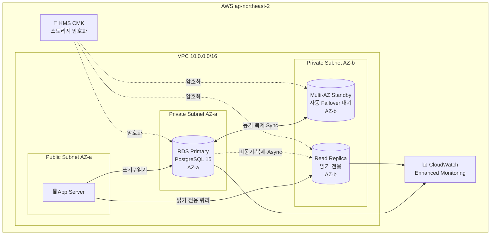

# Gym Management DB — PostgreSQL · AWS RDS · Terraform

**박광민**


피트니스 센터 운영 데이터(회원, 트레이너, PT 예약, 운동 기록, 결제)를 관리하는 데이터베이스 시스템입니다.  
Oracle XE 로컬 환경에서 시작해 **AWS RDS(PostgreSQL)로 클라우드 마이그레이션**, Terraform으로 Multi-AZ · Read Replica · KMS 암호화까지 인프라를 코드화했습니다.

---

## 아키텍처



---

## 기술적 의사결정

### Oracle 대신 PostgreSQL을 선택한 이유

| 항목 | Oracle XE | PostgreSQL 15 |
|------|-----------|---------------|
| AWS RDS 프리티어 | ❌ 없음 | ✅ db.t3.micro 750시간 |
| 라이선스 | 상용 | 오픈소스 |
| SQL 문법 호환성 | - | Oracle과 가장 유사 |
| 실무 채택률 | 레거시 중심 | 신규 서비스 1위 |

마이그레이션 시 주요 문법 변환:

```sql
-- Oracle
NUMBER PRIMARY KEY          →  INTEGER GENERATED ALWAYS AS IDENTITY PRIMARY KEY
VARCHAR2(50)                →  VARCHAR(50)
SYSDATE                     →  CURRENT_DATE
REGEXP_LIKE(col, '^\d{2}')  →  col ~ '^\d{2}'
```

### Multi-AZ vs Read Replica

두 기능 모두 "복제본"이지만 목적이 완전히 다릅니다.

| 항목 | Multi-AZ Standby | Read Replica |
|------|-----------------|--------------|
| 목적 | **고가용성(HA)** — 장애 복구 | **읽기 확장** — 부하 분산 |
| 복제 방식 | 동기(Synchronous) — 데이터 손실 없음 | 비동기(Asynchronous) — 약간의 지연 허용 |
| 직접 쿼리 | ❌ 불가 | ✅ 가능 |
| Failover | 자동 (60~120초) | 수동 프로모션 필요 |
| 비용 | Primary의 2배 | Primary와 동일 |

> **설계 결정**: 통계/리포트성 읽기 쿼리는 Read Replica로 라우팅해 Primary 부하를 줄이고, Multi-AZ로 단일 장애점(SPOF)을 제거했습니다.

### Terraform으로 인프라를 코드화한 이유

AWS 콘솔 클릭 대신 코드로 인프라를 정의하면:
- `dev` / `prod` 환경 차이를 **변수 3개**로 관리
- `terraform destroy` 한 줄로 과금 리소스 즉시 삭제
- Git으로 인프라 변경 이력 추적 가능

---

## 프로젝트 구조

```
gym-management-db/
├── 01_create_tables.sql          Oracle XE 스키마 (로컬 개발용)
├── 02_insert_sample_data.sql     샘플 데이터
├── 03_project_queries.sql        비즈니스 쿼리 (JOIN, 서브쿼리 등)
├── docker-compose.yml            Oracle XE 로컬 환경
│
├── sql/
│   └── 01_create_tables_pg.sql   PostgreSQL 15 마이그레이션 스키마
│
├── terraform/
│   ├── main.tf                   provider 설정
│   ├── variables.tf              dev/prod 입력 변수
│   ├── outputs.tf                endpoint, port 출력
│   ├── vpc.tf                    VPC, 서브넷, 보안 그룹
│   ├── rds.tf                    RDS Primary + Read Replica + IAM
│   ├── kms.tf                    KMS 암호화 키
│   └── terraform.tfvars.example  설정 예시
│
└── .github/workflows/
    └── lint.yml                  sqlfluff SQL 린트 CI
```

---

## 로컬 실행 (Docker)

Oracle XE 21c 환경을 Docker로 한 번에 실행합니다.

```bash
docker compose up -d
```

스키마와 샘플 데이터가 자동으로 초기화됩니다. 최초 실행 시 약 2~3분 소요됩니다.

| 항목 | 값 |
|------|----|
| Host | localhost |
| Port | 1521 |
| User | gymuser |
| Password | gymuser123 |
| SID | XE |

```bash
docker compose down     # 컨테이너만 종료 (데이터 유지)
docker compose down -v  # 컨테이너 + 볼륨 삭제
```

---

## AWS 배포 (Terraform)

### 사전 준비

```bash
aws configure  # AWS 자격증명 설정
```

### Stage 3 — dev (프리티어, Single-AZ)

```bash
cd terraform
cp terraform.tfvars.example terraform.tfvars
# terraform.tfvars에서 db_password 수정

terraform init
terraform plan
terraform apply
```

**예상 비용**: db.t3.micro 프리티어 기준 무료 (750시간/월)

### Stage 4 — prod (Multi-AZ + Read Replica + 암호화)

`terraform.tfvars`에서 아래 3개 플래그만 변경합니다.

```hcl
environment         = "prod"
multi_az            = true   # Standby 인스턴스 자동 생성
create_read_replica = true   # 읽기 전용 복제본 생성
storage_encrypted   = true   # KMS CMK로 디스크 암호화
```

```bash
terraform apply
```

**예상 비용 (ap-northeast-2)**

| 리소스 | 스펙 | 월 비용 |
|--------|------|---------|
| RDS Primary (Multi-AZ) | db.t3.small | ~$60 |
| Read Replica | db.t3.small | ~$30 |
| KMS CMK | - | ~$1 |
| **합계** | | **~$91** |

> 실습 후에는 반드시 `terraform destroy`로 리소스를 삭제하세요.

---

## DB 스키마

### ER 다이어그램


### 테이블 요약

| 테이블 | 설명 | 주요 컬럼 |
|--------|------|----------|
| Member | 회원 정보 | member_id, name, phone, expiry_date, remaining_pt_count |
| Trainer | 트레이너 정보 | trainer_id, name, specialty, career_year |
| Exercise | 운동 종목 | exercise_id, name, part |
| PT_Session | PT 예약 | session_id, member_id, trainer_id, session_date, status |
| Workout_Log | 운동 기록 | log_id, member_id, exercise_id, weight, sets, reps |
| Payment | 결제 내역 | payment_id, member_id, amount, method, category |

---

## CI — SQL 린트

`.sql` 파일 변경 시 **sqlfluff**가 자동으로 Oracle SQL 문법을 검사합니다.

```
.sql 파일 변경 push / PR
  └─ lint.yml : sqlfluff lint *.sql --dialect oracle
```

---

## 사용 기술

| 분야 | 기술 |
|------|------|
| 데이터베이스 | Oracle XE 21c (로컬), PostgreSQL 15 (AWS RDS) |
| SQL | DDL, DML, JOIN, 서브쿼리, 집계 함수 |
| 클라우드 | AWS RDS, VPC, KMS, IAM, CloudWatch |
| IaC | Terraform ≥ 1.6, AWS Provider ~5.0 |
| 컨테이너 | Docker, Docker Compose |
| CI | GitHub Actions, sqlfluff |
| 버전 관리 | Git, GitHub |

---

👤 **박광민** · 명지대학교 컴퓨터공학과
